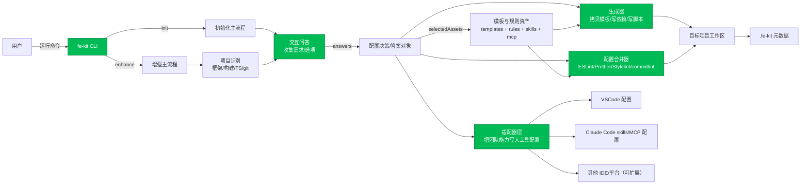

# fe-kit 项目汇报材料

---

## 一、项目概述

### 1) 项目是什么
**`fe-kit` 是一个前端项目脚手架/增强工具（命令行工具）**。

- 一句话：**用交互式问答，一键生成或改造前端项目，把“项目创建 + 规范配置 + 团队工具接入”标准化。**

### 2) 它做什么、解决什么问题
- **解决的问题**：团队每次新项目/新仓库都要重复做初始化工作（创建目录、选框架、配构建工具、配代码规范、配编辑器、接入协作与辅助工具），容易漏、容易不一致、交付慢、维护成本高。
- **提供的能力**：
  - **`init`**：从 0 创建新项目（React 或 Vue + TypeScript，可选 Vite/Webpack/Rspack）。
  - **`enhance`**：对已有项目叠加“增强包”（质量工具、编辑器配置、团队规则、辅助工具服务接入）。

### 3) 面向的用户是谁
- **研发同学**：快速起项目、减少手工配置、减少踩坑。
- **团队负责人/管理者**：把“工程标准”固化为工具，降低人员变动带来的质量波动。
- **新同学/跨团队协作**：开箱即用，不依赖“口口相传”搭环境。

### 4) 在业务中的角色
**它不是业务系统，而是研发基础设施/效率工具**：让业务项目更快、更一致、更容易维护，从而缩短交付周期、降低线上风险。

---

## 二、项目架构说明

### 一句话总体架构总结
**`fe-kit` = “问答收集需求” → “生成项目/配置” → “把规范与工具写进目标项目（VSCode/Claude Code 等）”。**

### 分模块说明
- **命令入口**
  像“前台接待”：接收 `init` / `enhance` 指令，负责执行主流程与兜底错误。

- **交互问答**
  像“需求采集表”：询问项目名称、路径、选 React/Vue、选构建方式、要不要路由/状态管理、要装哪些质量工具、要启用哪些团队技能/工具。

- **项目识别（增强模式）**
  像“体检报告”：自动判断当前项目大概是什么类型（React/Vue/Next/Nuxt、Vite/Webpack/Rspack、有无 TypeScript、有无 git）。

- **生成器（生成/写配置）**
  像“施工队”：拷贝模板、更新依赖与启动脚本、生成 ESLint/Prettier/Stylelint/commitlint 等规范配置。

- **适配器（对接不同工具）**
  像“安装工”：把团队能力写入不同开发工具与配置位置（例如 VSCode 的设置、Claude Code 的 skills、项目根的 MCP 配置等）。

- **模板与规则资产**
  像“标准化样板间 + 团队开发手册”：可直接复制的项目骨架与规则文档，便于复用与推广。

### 整体协作流程（数据如何流转）
用户在命令行选择需求 → 工具整理成“答案” → 生成器按答案创建/修改目标项目文件 → 适配器把团队能力写入开发工具配置 → 形成“能跑、规范一致、工具齐全”的项目。

### 架构图（模块与数据流）

---

## 三、项目使用流程

### 场景 A：从 0 创建新项目（`init`）
1. 在终端运行 `fe-kit init`
2. 按提示填写/选择：
   - 项目名、项目路径
   - React 或 Vue
   - 路由方案（按框架给默认）
   - 状态管理方案（按框架给可选项）
   - 构建工具（Vite / Webpack / Rspack）
   - 代码质量工具（默认推荐 ESLint + Prettier）
   - 要配置到哪些开发工具（默认 VSCode）
   - 要启用哪些内置 Skills
   - 要启用哪些 MCP 服务
3. 工具自动生成项目：
   - 拷贝对应模板（若无完整模板则生成最小可运行项目）
   - 写好依赖与启动脚本
   - 写入 `.fe-kit/` 元数据与规则文档
   - 写入选定工具的配置（如 VSCode/Claude Code）

**总结**：
“新同学只要回答 8~10 个问题，几分钟内就能拿到一个能启动、规范齐全、团队一致的 React/Vue 项目骨架。”

### 场景 B：把现有项目“一键增强”（`enhance`）
1. 进入已有项目目录（确保有 `package.json`）
2. 运行 `fe-kit enhance`
3. 工具自动识别项目类型（框架、构建工具、TS、git）
4. 选择要增强的内容：
   - 要配置到哪些开发工具（VSCode/Claude Code/IDEA 等）
   - 要安装并配置哪些质量工具（ESLint/Prettier/Stylelint/commitlint 等）
   - 要启用哪些 Skills 与 MCP
5. 工具写入配置并完成增强：
   - 更新 `.fe-kit/` 元数据
   - 生成/合并质量配置文件
   - 写入对应工具配置

---

## 四、核心功能与价值（功能 + 作用 + 价值）

- **1) 项目初始化（init）**
  - 作用：快速生成标准化前端项目骨架（React/Vue + TS，多种构建方式）。
  - 价值：把“1~2 天的手工搭建”压缩到“几分钟”，并保证起点一致。

- **2) 现有项目增强（enhance）**
  - 作用：在不推倒重来的前提下，为老项目补齐规范与工具链。
  - 价值：历史项目也能快速进入“可维护、可协作”的状态，减少“项目越做越乱”的成本。

- **3) 质量与规范工具一键配置**
  - 作用：自动安装并生成配置，减少人为差异。
  - 价值：减少低级错误、减少风格争论、提升评审效率，稳定性更可控。

- **4) 工具适配层（多编辑器/多平台）**
  - 作用：同一套团队能力落到不同工具里。
  - 价值：不被单一工具绑定，同时保证“换工具不换标准”。

- **5) 团队规则与能力资产沉淀（rules/skills/mcp）**
  - 作用：把最佳实践做成可分发、可复用的资产。
  - 价值：新项目/新成员直接继承经验，减少口头传承与重复踩坑。

---

## 五、项目优势总结（把技术优势翻译成管理价值）
- **效率提升**：把重复劳动变成自动化，缩短启动与交付周期。
- **一致性提升**：多项目共享“标准答案”，减少维护成本与沟通成本。
- **可复制性强**：模板 + 规则 + 工具配置资产化，适合规模化推广。
- **对新人友好**：把隐性经验变成问答与自动生成，降低上手门槛。
- **演进空间大**：流程分层清晰，后续扩展新框架/新工具成本低。

---

## 六、当前现状评估（阶段判断 + 依据）
### 结论：基础架构已成型，处于“早期可用（0.1.x）/可内部试点推广”的阶段
**判断依据（客观）**：
- 分层架构明确：命令、问答、探测、生成器、适配器、模板与规则资产齐备。
- 两条主链路可跑通：`init` 创建、`enhance` 增强，并写入 `.fe-kit/` 元数据。
- 版本号与元数据为 `0.1.0`，更像内部打磨期/试点期，而非长期稳定版。
- Webpack/Rspack 在“最小生成”里存在占位配置，说明部分组合仍在补齐中。

---

## 七、风险与后续建议

### 风险点（影响推广/维护/稳定性）
- **模板覆盖面风险**：无完整模板时会走“最小生成”；且 Webpack/Rspack 部分配置是占位内容，可能造成“预期落差”。
- **增强影响边界不够可解释**：`enhance` 会写入/合并多类配置文件；若缺少清晰的“变更清单与回滚方式”，推广时会被担心“会不会把我项目搞坏”。
- **回归保障不足（基于现有信息推测）**：脚本以 build/typecheck 为主，未看到系统性测试链路；对会改文件的工具而言，兼容风险需要机制兜底。
- **依赖版本策略风险**：初始化依赖偏新，存量环境可能需要 LTS/兼容选项与明确策略。

### 建议的下一阶段规划
- **建议 1：输出“可解释的变更报告”**
  每次 `enhance` 后打印/生成变更清单：新增/修改了哪些文件、安装了哪些依赖、如何回滚。
  管理价值：提升信任，降低推广阻力。

- **建议 2：模板成熟度分级**
  明确“完全模板/半自动/占位模板”，在交互里提示。
  管理价值：减少预期错配与返工。

- **建议 3：增强流程的回归测试**
  覆盖合并配置不丢字段、重复执行幂等、package.json 不被破坏等关键场景。
  管理价值：把“Never break userspace”落到机制上。

- **建议 4：沉淀公司级标准套餐**
  预设常用组合一键选择（例如 React+Vite+ESLint+Prettier+commitlint+VSCode）。
  管理价值：进一步降低选择成本，提升落地速度。

- **建议 5：非技术文档化收益对比**
  用“做之前/做之后”的时间与问题数对比讲 ROI。
  管理价值：更容易拿到资源与跨团队共识。

---

## 八、汇总
“我们这次做的 `fe-kit`，本质上是一个前端项目的标准化‘装修队’。过去一个新项目从创建到能稳定开发，需要团队成员手工做很多配置：选框架、配构建工具、装代码规范、配编辑器、接入协作工具——这些事情重复、容易漏，而且每个项目做法不一样，后续维护成本很高。

`fe-kit` 把这些步骤变成了一套交互式问答：你回答项目要用 React 还是 Vue、用哪种构建方式、需要哪些质量工具，它就会自动把项目骨架生成出来，或者对现有项目做增强，把规范和工具链补齐。这样新项目可以在几分钟内进入可开发状态，而且不同项目的标准一致，新人上手也更快。

从管理角度，它的价值不在于炫技术，而在于把工程规范固化成工具：减少重复劳动、缩短交付周期、降低低级错误、提升协作效率。当前版本属于早期可用阶段，架构已经成型，下一步我们会重点补齐模板成熟度、给增强流程加变更清单和回归保障，确保推广时不会影响现有项目的稳定性。”

